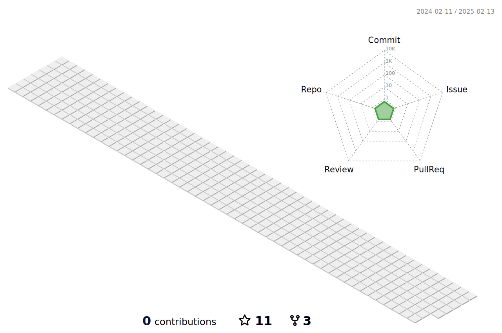

##

<h1 align="center">Hi All The Programmers' I AM <a href="https://github.com/yeaseen-564">Yeaseen Ahmed<a></h1>
 
<h1>Yeaseen Ahmed's Identity:</h1>
  
- I'm a student at High School
- I’m currently working on many small  projects using python
- I’m currently learning Programming Language[Dart and Flutter].
- I play PC games,Badminton,Cricket[Mostly I play PC games]

  

  
##

##

##

  

 

<!-- Don't Run Contribution Graph(Generate Snake) Action on your default Branch-->

