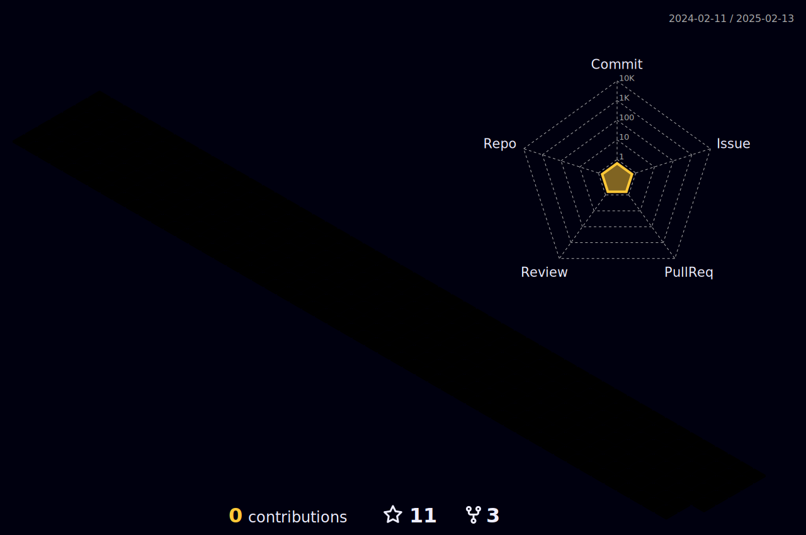

##
##

<h2> 𝐇𝐞𝐥𝐥𝐨 𝐭𝐡𝐞𝐫𝐞, 𝐟𝐞𝐥𝐥𝐨𝐰 CODERS <developers/>! </h2>

You have finally discovered my Github profile. 
 
Please feel free to clone/fork projects, raise issues and submit PRs if you think something could be better.
 
Ask me anything <a href="https://github.com/Yeaseen-564/yeaseen-564/issues/new"><b>here</b></a> 
or <a href="mailto:shekhyeaseeen@gmail.com"><b>email</b></a> me

<i>Happy Coding!</i> 😊

 

<h1>Yeaseen Ahmed's Identity:</h1>
  
- I'm a student at High School
- I’m currently working on many small  projects using python
- I’m currently learning Programming Language[Dart and Flutter].
- I play PC games,Badminton,Cricket[Mostly I play PC games]
  

##

##

  

 

##

 
